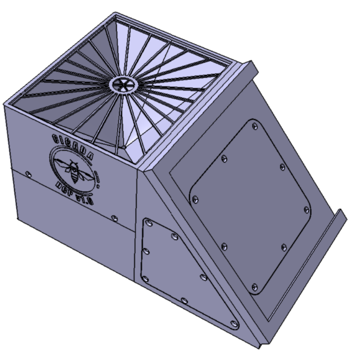
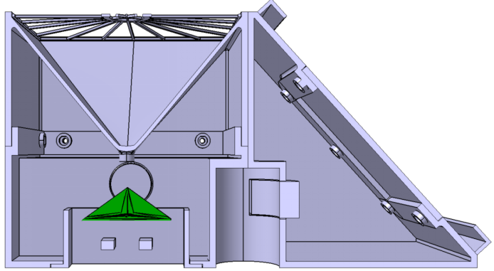

# Cicada DCP

Cicada DCP is an equipment design with a low-cost Datalogger and Sensors integrated into a Data Collection Platform that has requirement high reliability and freedom for adaptations. The Cicada DCP was designed for native interoperability with the Cicada Broker, and all project is open-source and documented.

In practice, the Cicada DCP is a monoblock device with an embeddable electronic system that allows the integration of sensors for monitoring the environment and actuators, e.g., alarm sirens. Cicada DCP has humidity, temperature, and rainfall sensors by default, as shown in Fig. 1.

	
	
  <b>Fig 1: Cicada DCP Body Design</b>

	
  <b>Fig 2: Cicada DCP 3d View</b>

The body of the Cicada DCP was designed with a simple yet functional concept to serve the most varied audiences, which allows its construction through <b>3D printing</b> or industrial processes such as plastic injection.

{% include alert.html type="info" content="The entire project was developed as a case study of <b>Fault & INtegration-Driven System Engineering (FIND-SE)</b>, a methodological approach to fault-tolerant systems engineering (SE). The approach extends the knowledge of Model-Based System Engineering (MBSE). It is based on the principle of guiding the developer in a design concerned with failures, and especially those related to interoperability in the system integration process, which must be tolerated and treated. FIND-SE's great advantage is the proposal of a new paradigm based on guiding development through a principle, the same concept used in the TDD (Test Driven Development) and BDD (Behavior Driven Development) techniques." %}

