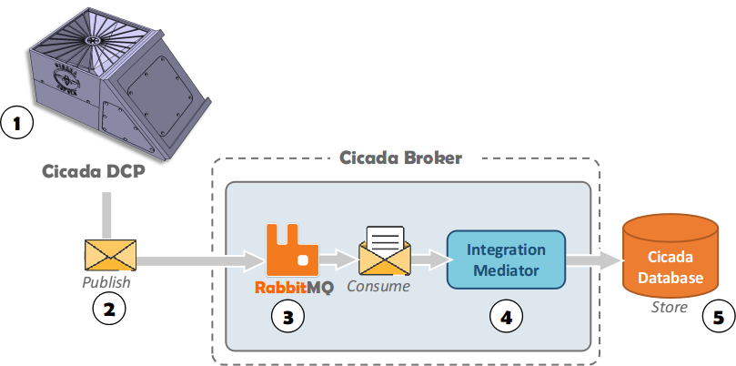

# Cicada Broker - Getting Started

The Cicada Broker Project was developed to send data through the MQTT protocol. In this project, the RabbitMQ server was used as the basis for Cicada Broker.

RabbitMQ is an open-source messaging server (open source) developed in Erlang, implemented to support messages in the Advanced Message Queuing Protocol (AMQP) natively; also, it has an adapter for MQTT.  It makes it possible to deal with message traffic quickly and reliably, in addition to being compatible with several programming languages, having a native administration interface, and being multiplatform.

Among the applications of RabbitMQ are to make it possible to guarantee asynchronicity between applications, decrease the coupling between applications, distribute alerts, and control the queue of jobs in the background.

<p align="center">
	
<br><br><b>Fig 1: Cicada Broker</b>
</p>

The Cicada Broker Project has 2 components, the Messaging Server(3-RabbitMQ) and the Integration Mediator(4). Messaging Server(3-RabbitMQ) is responsible for receiving the message and Integration Mediator(4) is responsible for consuming messages from the Messaging Server(3-RabbitMQ) queue and persisting them in the database.

The Cicada Broker Project was started with the primary objective of subsidizing the development of Cicada DCP.
In this way, the Integration Mediator component was implemented in the form of a prototype and still needs new developments to make it robust enough to Cicada Project.

<b>NOTE: Use at your own risk!</b>

## Messaging Server

We strongly recommend using RabbitMQ as the messaging server. Remember that RabbitMQ uses AMQP as the standard protocol. For it to work correctly with the Cicada DCP, the MQTT plugin must be active.

There are several commercial messaging servers based on RabbitMQ, such as <a href="https://www.cloudamqp.com/" target="_blank">CloudAMPQ</a>. 

If you choose to install your own RabbitMQ message server, see the official website <a href="https://www.rabbitmq.com/" target="_blank">www.rabbitmq.com</a>.

To install, see <a href="https://www.rabbitmq.com/download.html" target="_blank">www.rabbitmq.com/download.html</a>.

To activate the MQTT plugin, see <a href="https://www.rabbitmq.com/mqtt.html" target="_blank">www.rabbitmq.com/mqtt.html</a>.

## Integration Mediator

The Integration Mediator's main objective is to consume the data in the message server queue and translate the communication between Cicada DCP to perform the recording in the Database standard.
The first version in the form of a prototype was developed in Java, and its source code can be found in our repositories <a href="https://github.com/andreivo/CicadaProject/tree/main/brokerMediator" target="_blank">GitHub</a>.

If you want to use this integration mediator, download the source code and create the file <b>"./brokerMediator/src/main/java/com/fibase/QueueIdentity.java"</b>.
The QueueIdentity.java file contains the identities of access to the Message Servers, which must follow the following format:

```java
    //Identification of the message server that will be consumed. The keys are in the RabbitMQ standard. 
    public static String QUEUEUSERNAME = "username";
    public static String QUEUEVIRTUALHOST = "virtualhost";
    public static String QUEUEPASSWORD = "passwd";
    public static String QUEUEHOST = "hostname";
    public static String QUEUE_NAME = "queuename";
    public static String EXCHANGE_NAME = "exchangename";
    public static String ROUTINGKEY = "routingkey";

    //IoT server identification to simulating messages replication in another gateway. This service is optional and used for the publish on an MQTT server prepared to display on a Dashboard, like Ubidots.com.
    public static String MQTTTOKEN = "mqtttoken";
    public static String MQTTBROKERURL = "mqtthost";
    public static String MQTTTOPIC = "topic";
``` 

### Ontologies use

This project was developed based on the system engineering approaches proposed by FIND-SE, which presents semantic integration techniques for heterogeneous systems.

The observational network formed by the Cicada Project is firmly based on the composition of heterogeneous systems with operational independence. It is in this context that semantic conflicts or the difficulties that arise from this fact may occur. Semantic conflicts occur when systems use different meanings for the same elements: when the elements appear to have the same meaning but do not.

To solve this fact, the Mediator's project was built based on ontologies to define semantic mappings.


## Message Format


