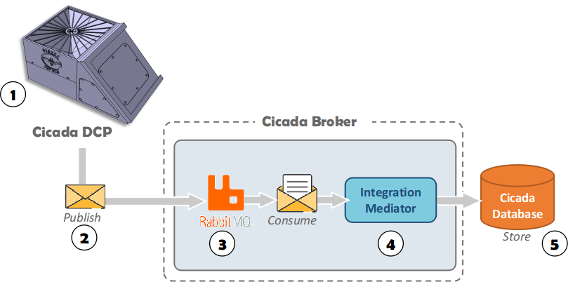

# Cicada Broker

The Cicada Broker project was developed to send data through the MQTT protocol. In this project, the RabbitMQ server was used as the basis for Cicada Broker.
Cicada Broker was also developed using FIND-SE's best practices and proposed a standard protocol for sending and receiving environmental data. 

	
  <b>Fig 1: Cicada Broker</b>

## Working in progress.

The Cicada Broker project was started with the primary objective of subsidizing the development of Cicada DCP.
In this way, the Integration Mediator component was implemented in the form of a prototype and still needs new developments to make it robust enough to Cicada Project.

To learn more about the Cicada Broker and the Integration Mediator, see the section .

You would like to collaborate with the project? Please contact our team in .
